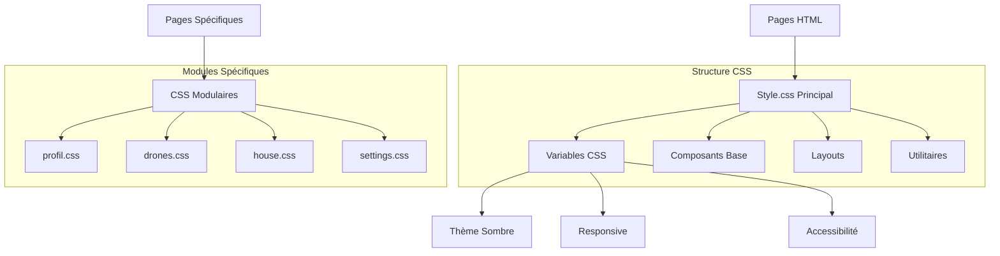

# Architecture Technique - Modernisation CSS Vulsshield

## 1. Architecture Design



## 2. Technology Description

- **Frontend**: HTML5 + CSS3 + Vanilla JavaScript
- **CSS Framework**: Custom CSS avec variables natives
- **Icons**: Font Awesome 6.0
- **Animations**: AOS (Animate On Scroll)
- **Build Tools**: Aucun (CSS natif)

## 3. Structure des Fichiers CSS

| Fichier | Purpose |
|---------|----------|
| /style.css | Fichier CSS principal avec variables globales et composants de base |
| /css/components.css | Composants UI réutilisables (boutons, cartes, formulaires) |
| /css/layout.css | Styles de mise en page (grid, flexbox, containers) |
| /css/utilities.css | Classes utilitaires (spacing, colors, typography) |
| /css/pages/profil.css | Styles spécifiques à la page profil |
| /css/pages/drones.css | Styles spécifiques à la page drones |
| /css/pages/house.css | Styles spécifiques à la page maison connectée |
| /css/responsive.css | Media queries et adaptations mobiles |

## 4. Variables CSS Centralisées

### 4.1 Système de Couleurs

```css
:root {
  /* Couleurs principales */
  --color-primary: #00ff88;
  --color-primary-dark: #00cc6a;
  --color-primary-light: #33ff9f;
  
  /* Backgrounds */
  --bg-primary: #1a1a1a;
  --bg-secondary: #2d2d2d;
  --bg-tertiary: #3a3a3a;
  --bg-accent: #404040;
  
  /* Texte */
  --text-primary: #ffffff;
  --text-secondary: #b0b0b0;
  --text-muted: #808080;
  --text-inverse: #1a1a1a;
  
  /* États */
  --color-success: #2ed573;
  --color-warning: #ffa502;
  --color-error: #ff4757;
  --color-info: #3742fa;
  
  /* Bordures */
  --border-color: #404040;
  --border-color-light: #555555;
  --border-color-dark: #2d2d2d;
}
```

### 4.2 Système d'Espacement

```css
:root {
  --space-0: 0;
  --space-1: 0.25rem;  /* 4px */
  --space-2: 0.5rem;   /* 8px */
  --space-3: 0.75rem;  /* 12px */
  --space-4: 1rem;     /* 16px */
  --space-5: 1.25rem;  /* 20px */
  --space-6: 1.5rem;   /* 24px */
  --space-8: 2rem;     /* 32px */
  --space-10: 2.5rem;  /* 40px */
  --space-12: 3rem;    /* 48px */
  --space-16: 4rem;    /* 64px */
}
```

### 4.3 Système Typographique

```css
:root {
  /* Tailles de police */
  --text-xs: 0.75rem;   /* 12px */
  --text-sm: 0.875rem;  /* 14px */
  --text-base: 1rem;    /* 16px */
  --text-lg: 1.125rem;  /* 18px */
  --text-xl: 1.25rem;   /* 20px */
  --text-2xl: 1.5rem;   /* 24px */
  --text-3xl: 1.875rem; /* 30px */
  --text-4xl: 2.25rem;  /* 36px */
  
  /* Poids de police */
  --font-light: 300;
  --font-normal: 400;
  --font-medium: 500;
  --font-semibold: 600;
  --font-bold: 700;
  
  /* Hauteur de ligne */
  --leading-tight: 1.25;
  --leading-normal: 1.5;
  --leading-relaxed: 1.75;
}
```

## 5. Composants CSS Modulaires

### 5.1 Système de Cartes

```css
/* Carte de base */
.card {
  background: var(--bg-secondary);
  border: 1px solid var(--border-color);
  border-radius: var(--radius-md);
  box-shadow: var(--shadow-sm);
  overflow: hidden;
  transition: all 0.2s ease;
}

/* Variantes de cartes */
.card--elevated {
  box-shadow: var(--shadow-lg);
}

.card--interactive:hover {
  transform: translateY(-2px);
  box-shadow: var(--shadow-xl);
  border-color: var(--color-primary);
}

.card--danger {
  border-color: var(--color-error);
}

.card--success {
  border-color: var(--color-success);
}
```

### 5.2 Système de Boutons

```css
/* Bouton de base */
.btn {
  display: inline-flex;
  align-items: center;
  justify-content: center;
  gap: var(--space-2);
  padding: var(--space-3) var(--space-6);
  border: none;
  border-radius: var(--radius-md);
  font-size: var(--text-sm);
  font-weight: var(--font-medium);
  text-decoration: none;
  cursor: pointer;
  transition: all 0.2s ease;
  user-select: none;
}

/* Variantes de boutons */
.btn--primary {
  background: var(--color-primary);
  color: var(--text-inverse);
}

.btn--secondary {
  background: var(--bg-tertiary);
  color: var(--text-primary);
  border: 1px solid var(--border-color);
}

.btn--ghost {
  background: transparent;
  color: var(--text-secondary);
  border: 1px solid var(--border-color);
}

/* Tailles de boutons */
.btn--sm {
  padding: var(--space-2) var(--space-4);
  font-size: var(--text-xs);
}

.btn--lg {
  padding: var(--space-4) var(--space-8);
  font-size: var(--text-lg);
}
```

### 5.3 Système de Formulaires

```css
/* Groupe de formulaire */
.form-group {
  margin-bottom: var(--space-6);
}

/* Label */
.form-label {
  display: block;
  margin-bottom: var(--space-2);
  font-size: var(--text-sm);
  font-weight: var(--font-medium);
  color: var(--text-primary);
}

/* Input de base */
.form-input {
  width: 100%;
  padding: var(--space-3) var(--space-4);
  background: var(--bg-tertiary);
  border: 1px solid var(--border-color);
  border-radius: var(--radius-md);
  color: var(--text-primary);
  font-size: var(--text-base);
  transition: all 0.2s ease;
}

.form-input:focus {
  outline: none;
  border-color: var(--color-primary);
  box-shadow: 0 0 0 3px rgba(0, 255, 136, 0.1);
}

/* États d'erreur */
.form-input--error {
  border-color: var(--color-error);
}

.form-input--error:focus {
  box-shadow: 0 0 0 3px rgba(255, 71, 87, 0.1);
}
```

## 6. Responsive Design

### 6.1 Breakpoints

```css
:root {
  --breakpoint-sm: 640px;
  --breakpoint-md: 768px;
  --breakpoint-lg: 1024px;
  --breakpoint-xl: 1280px;
  --breakpoint-2xl: 1536px;
}
```

### 6.2 Grid System

```css
/* Container responsive */
.container {
  width: 100%;
  margin: 0 auto;
  padding: 0 var(--space-4);
}

@media (min-width: 640px) {
  .container { max-width: 640px; }
}

@media (min-width: 768px) {
  .container { max-width: 768px; }
}

@media (min-width: 1024px) {
  .container { max-width: 1024px; }
}

/* Grid responsive */
.grid {
  display: grid;
  gap: var(--space-6);
}

.grid--1 { grid-template-columns: 1fr; }
.grid--2 { grid-template-columns: repeat(2, 1fr); }
.grid--3 { grid-template-columns: repeat(3, 1fr); }
.grid--4 { grid-template-columns: repeat(4, 1fr); }

@media (max-width: 768px) {
  .grid--2,
  .grid--3,
  .grid--4 {
    grid-template-columns: 1fr;
  }
}
```

## 7. Optimisations Performance

### 7.1 CSS Critical Path

```css
/* Styles critiques inline dans <head> */
/* Variables CSS */
/* Layout de base */
/* Composants above-the-fold */
```

### 7.2 Lazy Loading CSS

```html
<!-- CSS non-critique chargé de manière asynchrone -->
<link rel="preload" href="/css/components.css" as="style" onload="this.onload=null;this.rel='stylesheet'">
<link rel="preload" href="/css/pages/profil.css" as="style" onload="this.onload=null;this.rel='stylesheet'">
```

### 7.3 Purge CSS

```css
/* Suppression automatique des styles non utilisés */
/* Configuration pour PurgeCSS */
```

## 8. Accessibilité (WCAG 2.1)

### 8.1 Contraste des Couleurs

```css
/* Ratios de contraste conformes */
:root {
  --contrast-aa: 4.5; /* Minimum AA */
  --contrast-aaa: 7;  /* Minimum AAA */
}

/* Vérification automatique */
.text-primary { /* Contraste: 15.3:1 ✓ */ }
.text-secondary { /* Contraste: 6.8:1 ✓ */ }
.text-muted { /* Contraste: 4.6:1 ✓ */ }
```

### 8.2 Focus Management

```css
/* Focus visible pour navigation clavier */
.focus-visible {
  outline: 2px solid var(--color-primary);
  outline-offset: 2px;
}

/* Suppression du focus par défaut */
:focus:not(.focus-visible) {
  outline: none;
}
```

### 8.3 Reduced Motion

```css
/* Respect des préférences utilisateur */
@media (prefers-reduced-motion: reduce) {
  *,
  *::before,
  *::after {
    animation-duration: 0.01ms !important;
    animation-iteration-count: 1 !important;
    transition-duration: 0.01ms !important;
    scroll-behavior: auto !important;
  }
}
```

## 9. Testing et Validation

### 9.1 Tests Automatisés

```javascript
// Tests de régression CSS
// Validation des contrastes
// Tests responsive
// Tests d'accessibilité
```

### 9.2 Outils de Validation

- **Stylelint** - Linting CSS
- **axe-core** - Tests d'accessibilité
- **Lighthouse** - Performance et bonnes pratiques
- **WAVE** - Validation d'accessibilité

## 10. Documentation et Maintenance

### 10.1 Style Guide

```css
/* Documentation des composants */
/* Exemples d'utilisation */
/* Guidelines de contribution */
```

### 10.2 Versioning CSS

```css
/* Versioning sémantique */
/* Changelog des modifications */
/* Migration guides */
```

Cette architecture technique garantit une base solide pour la modernisation CSS de toutes les pages Vulsshield avec une approche modulaire, performante et accessible.